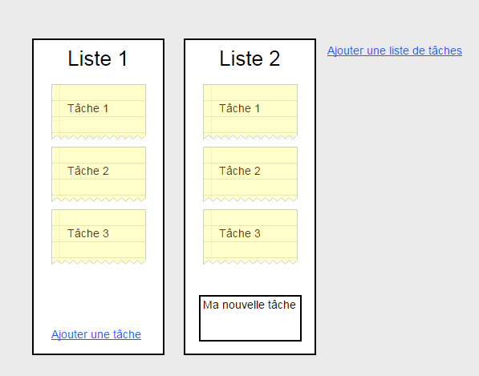

Task manager
============

Explication du projet
---------------------
Le but de ce projet est de créer un utilitaire qui permet une gestion collaborative de tâches et de liste via un système de post-it (inspiré de [trello](https://trello.com/)).

- Vous devez utiliser socket.io pour la gestion en temps réel des changements de tâches / liste de tâche etc...
- Les données devront être stocker dans une base de données mongoDB.
- Vous être libre d'utiliser la technologie que vous voulez pour le frontend

Fonctionnalités de base
------------------------

Voici les fonctionnalités de base que le projet devra être en mesure de réaliser:

- Ajouter des liste de tâche
- Editer le nom de la liste de tâches
- Ajouter une tâche à une liste
- Editer une tâche
- Changer une tâche de liste en drag and drop
- Changer l'ordre des listes de tâches en drag and drop

L'application devra ressembler à ça:

Fonctionnalités bonus
---------------------

Une fois que la base sera fini, vous allez pouvoir étendre les fonctionnalités de vos tâche.

- Changer la couleur de fond de la tâche
- Laisser des commentaires dans une tâche
- Ajouter une checklist à une tâche

Documentations
--------------

- [Socket.io](http://socket.io/docs/)
- [HTML5 Drag and Drop](http://www.w3schools.com/html/html5_draganddrop.asp)

## Mongoose
- [Models](http://mongoosejs.com/docs/models.html)
- [Populations](http://mongoosejs.com/docs/populate.html)
- [Queries](http://mongoosejs.com/docs/queries.html)
- [Validation](http://mongoosejs.com/docs/validation.html)

